## Hi there, I'm Dusan 👋

<!-- 

-->

I'm a Telecommunications and Information Technologies Engineer from Serbia. I have a bachelor's degree in Electrical Engineering and Computing from the School of electrical engineering in Belgrade. I mainly code in Python and MATLAB, but I'm always learning.  

<!-- Profile picture was made with https://javier.xyz/pintr/ -->

<!-- Start small bullet points -->
- 🔭 Working as a RAN Solution Architect at Ericsson Serbia<!--Currently job hunting ... -->
- 🎓 Graduated from School of Electrical Engineering University of Belgrade
- 🌱 Currently learning Node.js and Express.js
- 🌐 Know more about me on my [portfolio](https://stokicdusan.github.io/) page
- ⚡ Fun fact: $3^3+4^4+3^3+5^5=3435$
<!-- End small bullet points -->

<!-- start how to reach me -->
<!-- ### 📫 How to reach me:  
<!--   &nbsp;   &nbsp;  &nbsp; <a href="mailto:stokicdusan@gmail.com">   
<!-- end how to reach me -->

<!-- start languages and tools -->
### 👨🏻‍💻 Languages and Tools:    

<!--  -->
   
<!-- end languages and tools -->

<!-- start statics fun section -->
### 📃:rocket: GitHub stats:  

<!--  -->
  
  

<!-- end statics fun section -->

<!-- RAINBOW LINE BOT -->

